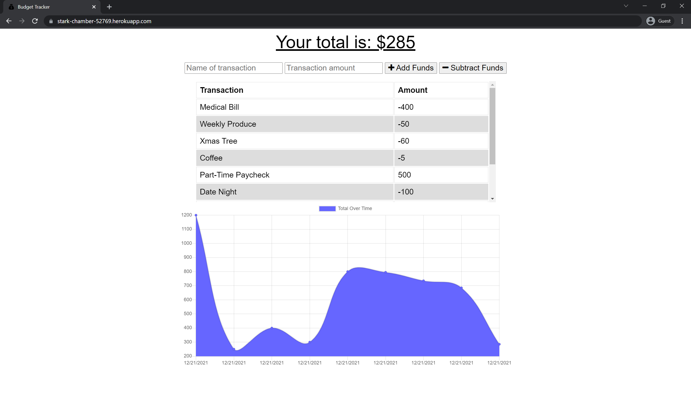

# Budget Tracker

## Description

A budget tracker application with offline access and functionality, allowing users to add expenses and deposits to their budget with or without a connection.

## Table of Contents

* [User Story](#user-story)
* [Installation](#installation)
* [Screenshot](#screenshot)
* [License](#license)
* [Questions](#questions)

## User Story

AS AN avid traveler  
I WANT to be able to track my withdrawals and deposits with or without a data/internet connection  
SO THAT my account balance is accurate when I am traveling  

## Installation

No installation required! Navigate to https://stark-chamber-52769.herokuapp.com/

## Screenshot

## License

Distributed under the [Unlicense](https://choosealicense.com/licenses/unlicense/).

## Questions

* GitHub Profile: [JPDBrodeur](https://github.com/JPDBrodeur)

* Have any additional questions? You can reach me by email at [jbrodeur001@gmail.com](mailto:jbrodeur001@gmail.com).